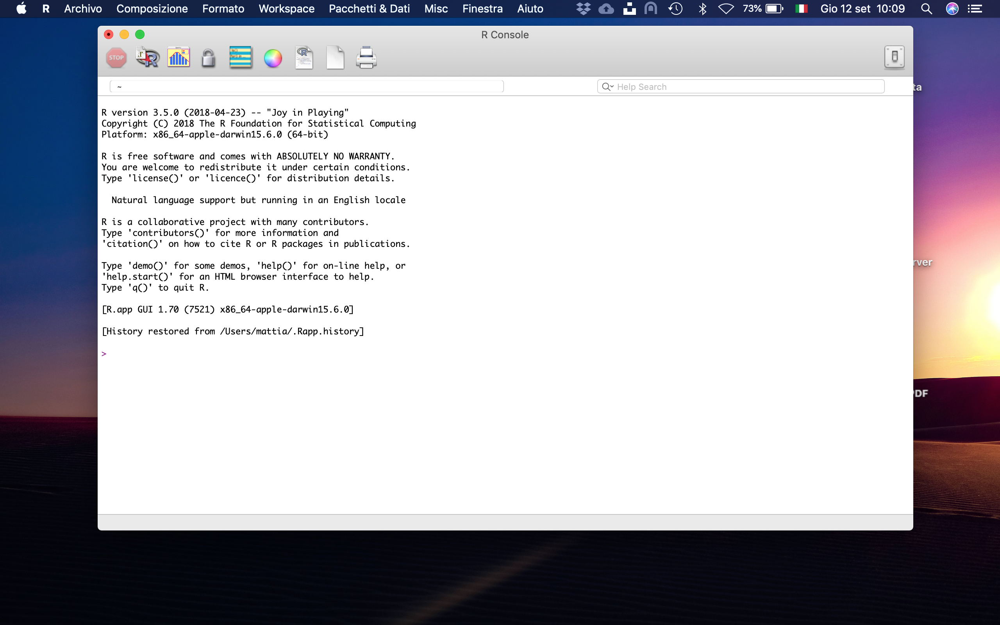
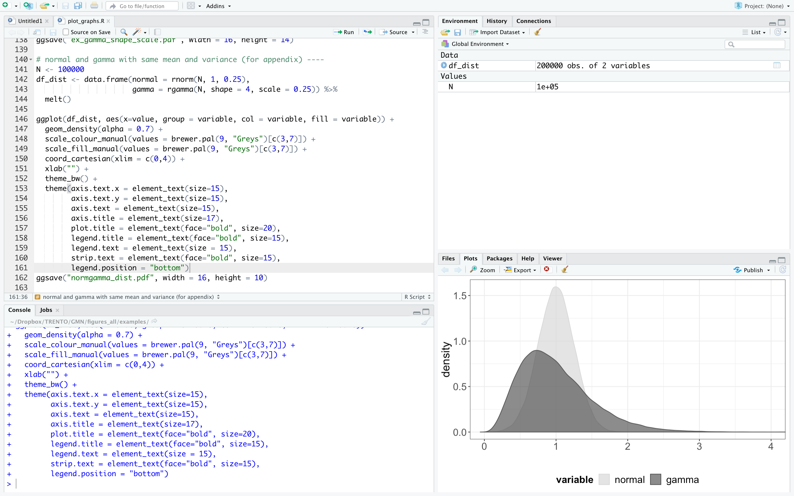

```{r setup, include=FALSE, echo=FALSE}
library(knitr)
opts_chunk$set(echo = FALSE)

library(tidyverse)
library(reshape2)
```

# What is R

R is both a programming language and software environment for statistical computing, which is free and open-source (<https://www.r-project.org/about.html>).

The \emph{R Project} was initiated by Robert Gentleman and Ross Ihaka (University of Auckland) in the early 1990s as a different implementation of the S language, which was developed at Bell Laboratories.

Since 1997, R has been developed by the \emph{R Development Core Team}.

R is platform independent and can run on Microsoft Windows, Mac OS and Unix/Linux systems.

Popularity: <https://www.tiobe.com/tiobe-index/>

## Resources and Disclaimer
The material is largely based on:
* Introduction to R for the Université Côte d'Azur: https://github.com/mattiaguerini/slides-intro-to-R

* Applied Statistics for Bioinformatics using R by Wim P. Krijnen, 2009: https://faculty.ucr.edu/~tgirke/Documents/R_BioCond/documentation/Krijnen-IntroBioInfStatistics.pdf

* Rstudio4edu: https://github.com/dcossyleon/basic-course-website

* Applied Statistics using R: https://github.com/daviddalpiaz/appliedstats/

* Boston University Course: https://sphweb.bumc.bu.edu/otlt/MPH-Modules/BS/R/R2_SummaryStats-Graphs/R2_SummaryStats-Graphs_print.html

* Software Carpentry: https://github.com/swcarpentry/r-novice-inflammation and https://github.com/swcarpentry/r-novice-gapminder

* A Quick Intro to Chemical Informatics in R: https://www.cureffi.org/2013/09/23/a-quick-intro-to-chemical-informatics-in-r/

## Getting Started
To get started, you'll need to install two pieces of software:

- R, the actual programming language. <https://cran.r-project.org>

- RStudio, an excellent IDE for working with R. <https://www.rstudio.com>

Why RStudio?\footnote{\scriptsize You must have installed R before using RStudio.}

- Easier to use (everything is in one space)

- Many useful integrations (e.g. R-projects, R-markdown, shiny ...)

- Plenty of shortcuts (alt + shift + k)

- Plenty of cheatsheets (see top panel)

## Screenshot of RConsole


## Screenshot of RStudio


## Glossary
- **command**: user input (text or numbers) that R understands

- **script**: a sequence of commands collected in a text file, each separated by a new line

- **environment**: a list of named variables that we have generated/imported by means of a series of commands

- **history**: the list of past commands thaty we have used

- **help**: a documentation of all the functions available in R (the user manual)

- **package**: a collection of additional functions and dataset

```{r knit_exit, include=F, echo=F}
knit_exit()
```
