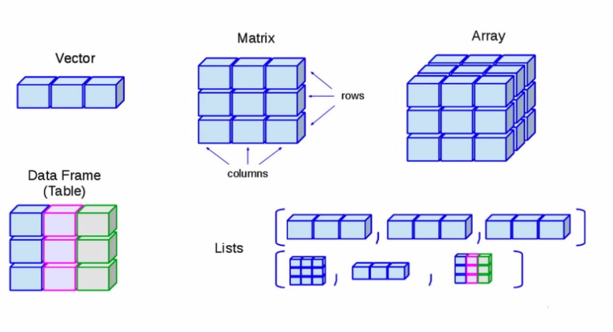

```{r setup, include=FALSE}
library(knitr)
knitr::opts_chunk$set(echo = TRUE)
```

# R operations

## R as a calculator (I)
\footnotesize
```{r calculator1, include=T, echo=T}
2+2
2-2
2*2
2/2
```
\normalsize

## R as a calculator (II)
\footnotesize
```{r calculator2, include=T, echo=T}
log(1)
exp(1)
log(exp(1))
sqrt(25)
```
\normalsize

## The help
\footnotesize
```{r help, include=T, echo=T, eval = FALSE}
?log
help(log)
```
\normalsize

Otherwise:

- Google your error message

- Ask for help in Stack Overflow

## Packages
R comes with a number of built-in functions and datasets, but one of the main strengths of R as an open-source project is its package system.

Packages gives you access to additional functions and datasets.

If you want to do something which is not doable with the R basic functions, there is a good chance that there exist a package that will fulfill your needs.

You can install packages using the command `install.packages("")`

You can load packages using the command `library()`

You can check for installed packages using the command `installed.packages()`

You can check R version `R.version`

# Exercise break (in Console: CMD -> R.exe)

## Environment and math
```{r environment_math, echo=T, include=T, eval=F}
installed.packages()
getwd()
R.version
1 + 1
2 + 3 * 4
4 * 3 + 2
(2 + 3) * 4
(4 * 3) + 2
3 ^ 2
exp(1)
pi
2*pi*6378 # Circumference of earth at the equator (in km)
```

## Variables
Variables are assigned a value either using "=" or "<-"
Re-write this calculation so that it doesn’t use variables:
```{r define_variable1, echo=T, include=T, eval=T}
a <- 4 * 20
b <- 7
a + b
```
\normalsize
Re-write this calcuation over multiple lines, using a variable:
```{r define_variable2, echo=T, include=T}
2 + 2 + 2
a <- 2
b <- 3
a * b
```
# Data structures

## Data types

- Numeric/Double (e.g. 2.5, 1/5, 1.0, \dots)

- Integer (e.g. 1, 2, 3, \dots)

- Complex (e.g. 1 + 2i, \dots)

- Logical (e.g. TRUE, FALSE or NA)

- Character (e.g. "a", "paper", "2 plus 2 = 5", "TRUE", \dots)

- Factor/Categorical ("male", "female", \dots)

## Data structures


## Vectors (I)

You can create a vector using the command `c()`
\footnotesize
```{r vectors_base, include=T, echo=T}
x <- c(1, 3, 5, 10)
x
```
\normalsize

Vectors must contain elements of the same data type.
\footnotesize
```{r vectors_type, include=T, echo=T}
c(1, "intro", TRUE)
```
\normalsize

You can measure the length of a vector using the command `length()`
\footnotesize
```{r vectors_length, include=T, echo=T}
length(x)
```
\normalsize

## Vectors (II)
It is also possible to easily create sequences
\footnotesize
```{r vectors_sequences, include=T, echo=T}
1:10
seq(from = 1, to = 2, by = 0.1)
rep("A", times = 5)
```
\normalsize

## Vectors (III)
You can combine different vectors
\footnotesize
```{r vectors_multiple, include=T, echo=T}
x <- 1:3 # from 1 to 3
y <- c(10, 15) # 10 and 15
z <- c(x,y) # x first and then y
z
```
\normalsize

And you can repeat vectors (or its elements)
\footnotesize
```{r vectors_repeat, include=T, echo=T}
z <- rep(y, each=3) # repeat each element 3 times
z
z <- rep(y, times=3) # repeat the whole vector 3 times
z
```
\normalsize

## Subsetting Vectors
\footnotesize
```{r vectors_subset, include=T, echo=T}
x <- c(1, 5, 10, 7)
x < 6 # is the element lower than 6?
x == 10 # is the element equal to 10?
x[2] # which element is in the second position?
x[1:2] # which elements are in the first 2 positions?
x[c(1,3,4)] # which elements are in positions 1, 3 and 4?
```
## Subsetting Vectors
\footnotesize
```{r vectors_subset2, include=T, echo=T}
n <- c(1, 4, 5, 6, 7, 2, 3, 4, 5, 6) # creates a vector, stores it in n
length(n) # number of elements
n[3] # extract 3 rd element in n
n[-2] # extract all of n but 2nd element
n[c(1,3,4)] # extract first, third, and fourth element of n
n[n < 4] #extract all elements in n smaller than 4
n[n < 4 & n != 1] # extract element smaller than 4 AND different from 1
```
\normalsize

## Exercise break
\footnotesize
```{r vectors_subset4, include=T, echo=T}
n <- c(1, 4, 5, 6, 7, 2, 3, 4, 5, 6) # creates a vector, stores it in n
```
\normalsize
* number of elements
* extract first three elements of n
* extract all of n but 3nd element
* extract first, third, and fourth element of n
* extract element smaller than 4 OR equal to 5


## Exercise break
We can create and index character vectors as well. A cafe is using R to create their menu.
\footnotesize
```{r vectors_subset5, include=T, echo=T}
items <- c("apples", "oranges", "eggs", "tomatoes", "bananas")
```
\normalsize
* What does items[-3] produce?
* Based on what you find, use indexing to create a version of items without "bananas".
* Use indexing to create a vector containing apples, eggs, tomatoes, bananas, and bananas.
* Add a new item, "lemons", to items.
* Make items[3] "berries".


## Vectors' Operations
\footnotesize
```{r vectors_operations, include=T, echo=T}
x <- c(1,5,10,7)
x+2 # adds a scalar to all elements
x^2 # what's the square of all elements?
```
\normalsize

## Matrices (I)
You can create a matrix using the command `matrix()`
\footnotesize
```{r matrix, include=T, echo=T}
X <- matrix(1:9, nrow = 3, ncol = 3)
X
```
\normalsize

## Matrices (II)
R automatically inserts elements by columns, but we can ask to include by rows
\footnotesize
```{r matrix_byrow, include=T, echo=T}
X <- matrix(1:9, nrow = 3, ncol = 3, byrow = TRUE)
X
```
\normalsize

You don't even have to specify the options names
\footnotesize
```{r matrix_silent, include=T, echo=T}
X <- matrix(1:8, 2, 4, T)
X
```
\normalsize

## Matrices (III)
Matrices can also be created by combining vectors
\footnotesize
```{r matrix_fromvectors, include=T, echo=T}
X <- cbind(1:4, 6:9) # binds them as columns
X
X <- rbind(1:4, 6:9) # binds them as rows
X
```
\normalsize

## Subsetting Matrices
\footnotesize
```{r matrix_subset, include=T, echo=T}
X>5 # elements larger than 5
X[1,4] # element of first row, fourth column?
X[1,] # element in the first row?
X[,2] # elements in the second columns?
```
\normalsize

## Lists
A list is a one-dimensional heterogeneous data structure.

It is indexed like a vector with a single integer value (or a name), but each element can contain an element of any data type.
\footnotesize
```{r list, include=T, echo=T}
x <- 1:4
y <- c("a", "b", "c")
L <- list(numbers = x, letters = y)
L
```
\normalsize

## Subsetting Lists
\footnotesize
```{r list_subsetting, include=T, echo=T}
L[[1]] # extract the first element
L$numbers # extract the element called numbers
L$letters # extract the element called letters
```
\normalsize

You can even "work" with the subsetted element:
\footnotesize
```{r list_subsetting2, include=T, echo=T}
L$numbers[1:3] > 2
```
\normalsize

## Exercise break
\footnotesize
```{r letters, include=T, echo=T, eval=F}
letters
LETTERS
my_letters <- cbind(LETTERS, letters)
class(my_letters)
dim(my_letters)
my_letters <- cbind(my_letters, seq(1:length(letters)))
```
\normalsize
What number is the letter F in the English alphabet?


## Exercise
```{r dna_ex1, include = T, echo=T, eval=F}
# vector ... etc.
my_dna <- "AACGAATGAGTAAATGAGTAAATGAAGGAATGATTATTCCTTGCTTTAGAACTTCTGGAATTAGAGGACA
ATATTAATAATACCATCGCACAGTGTTTCTTTGTTGTTAATGCTACAACATACAAAGAGGAAGCATGCAG"
my_dna
length(my_dna)
class(my_dna)
str(my_dna)
nchar(my_dna)

# appr1
my_dna_comma <- sapply(strsplit(
  x = my_dna, split = "", fixed = TRUE),
       function(x) paste(x, collapse = "_"))
length(my_dna_comma)
str(my_dna_comma)

my_dna_list <- strsplit(x = my_dna, split = "", fixed = TRUE)
length(my_dna_list)
class(my_dna_list)
my_dna_vector <- unlist(my_dna_list)
length(my_dna_list[[1]])
str(my_dna_vector)
length(my_dna_vector)

# first nucleotide
my_dna_vector[1]
# indexing 1:nchar(my_dna)
my_dna_vector[1:50]
# unique characters
unique(my_dna_vector)

# number of As
(my_dna_vector == "A")
length(my_dna_vector[my_dna_vector == "A"])

# remove \n
remove_nuc <- match("\n", my_dna_vector)
which(my_dna_vector %in% c("\n", "X"))
my_dna_vector[remove_nuc] <- "A"
my_dna_vector_2 <- my_dna_vector[-71]
unique(my_dna_vector_2)
```

## Data Frames (I)
A `data.frame` is similar to a typical `spreadsheet` in excel.

There are rows, and there are columns.

A row is typically thought of as an \emph{observation}.

A column is a certain \emph{variable}, characteristic or feature of that observation.

## Data Frames (II)
A data frame is a list of column vectors where:

- each column has a name

- each column must contain the same data type, but the different columns can store different data types.

- each column must be of same length

## Data Frames (III)
\scriptsize
```{r dataframe, include=T, echo=T}
set.seed(1)
df <-  data.frame(id = 1:5,
  name = c("Diego", "Samuel", "Marco", "Javier", "Leonardo"),
  surname = c("Milito", "Eto'o", "Materazzi", "Zanetti", "Bonucci"),
  wage = rnorm(n=5, mean = 10^5, sd = 10^3), # normal random sample
  origin = c("Argentina", "Cameroon", "Italy", "Argentina", "Italy"),
  treble_winner = c(T, T, T, T, F)
  )
df
```
\normalsize

You can verify the size of the `data.frame` using the command `dim()`

You can get the `data type` info using the command `str()`

## Subsetting Data Frames (I)
\footnotesize
```{r dataframe_subset, include=T, echo=T}
df$name # subset a column
df[,c(2,5)] # can also subset like a matrix
```
\normalsize

## Subsetting Data Frames (II)
\footnotesize
```{r dataframe_subset2, include=T, echo=T}
head(df, n=3) # first n observations
tail(df, n=3) # last n observations
```
\normalsize

## Inspecting data frames (I)
R comes with many data bases included. These can be used for learning R.

One of the most famous is the one called `mtcars`.
\scriptsize
```{r dataframe_mtcars, include=T, echo=T}
head(mtcars)
tail(mtcars)
dim(mtcars)
```
\normalsize

## Inspecting data frames (II)
\scriptsize
```{r dataframe_mtcars2, include=T, echo=T}
str(mtcars)
names(mtcars)
```
\normalsize

## Subsetting data frames (III)
We are interesting in the cylinders and the weights of inefficient cars (lower than 15 miles per gallon).
\scriptsize
```{r dataframe_subset_mtcars, include=T, echo=T}
poll_cars <- mtcars[mtcars$mpg<15, c("cyl", "wt")]
poll_cars
```
\normalsize

## Subsetting data frames (IV)
Alternatively:
\scriptsize
```{r dataframe_subset_mtcars2, include=T, echo=T}
poll_cars <- subset(mtcars, subset = mpg<15, select = c("cyl", "wt"))
poll_cars
```
\normalsize

## Importing downloaded data frames (.csv)
You can import csv data that you have downloaded from any external source using:
\scriptsize
```{r import_data2, include=T, echo=T, eval=F}
setwd("data")
nyc_ab <- read.csv("AB_NYC_2020.csv")
```
\normalsize

where:

- `setwd()` sets the working directory to the place where the data is saved;

- `read.csv()` loads the csv file with the specified name.

You can similarly import almost any kind of data file stored in other formats (.xls, .txt, .csv, .dta, .Rdata, .mat, ...)

## Importing downloaded data frames (.txt)
Interferon regulatory factor 6 mouse
\scriptsize
```{r import_data3, include=T, echo=T, eval=F}
setwd("data")
irf6 <- read.table("irf6.txt", header = TRUE, row.names = 1)

# explore
head(irf6)
ncol(irf6); nrow(irf6)
dim(irf6)
```
## Importing downloaded data frames (.txt)
\scriptsize
```{r import_data4, include=T, echo=T, eval=F}
irf6 <- read.table("data/irf6.txt", header = TRUE, row.names = 1)
class(irf6)
str(irf6)
colnames(irf6)
head(rownames(irf6))

```
## Importing downloaded data frames (.txt)
\scriptsize
```{r import_data5, include=T, echo=T, eval=F}
irf6 <- read.table("data/irf6.txt", header = TRUE, row.names = 1)

head(irf6['E17.5KO1']) # Retrieve only E17.5KO1 data
head(irf6[, 1]) # as well
head(irf6$E17.5KO1) # as well
dim(irf6[, -1]); colnames(irf6[, -1])  # Exclude E17.5KO1 data
```

# Exercise break

## Total lung capacity
\footnotesize
```{r tlc, include=T, echo=T, eval=F}
  tlc <- read.csv("data/tlc.csv")
  str(tlc)
  summary(tlc)
  subset(tlc, sex == 1)
  subset(tlc, age < 20, tlc)
  mean(subset(tlc, sex == 1, select = tlc, drop = T))
```

# Apply
## Vectorization
* Returns	a	vector or array or list
* obtained by applying a function to margins of a matrix
* apply(X, MARGIN, FUN, ...)
* X :	data
* MARGIN :	1 for rows, 2 for columns
* FUN: function
  \scriptsize
  ```{r apply, include=T, echo=T}
x <- cbind(x1 = 3, x2 = c(4:1, 2:5))
col.sums <- apply(x, 2, sum)
row.sums <- apply(x, 1, sum)
```

```{r knit_exit, include=F, echo=F}
knit_exit()
```
